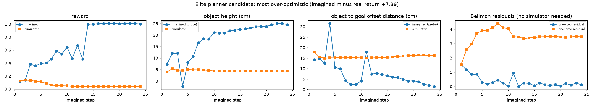
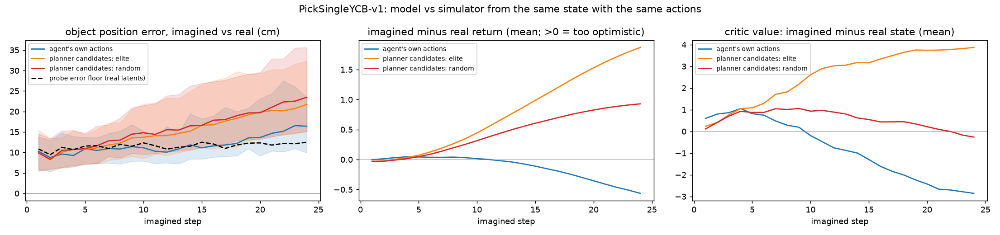
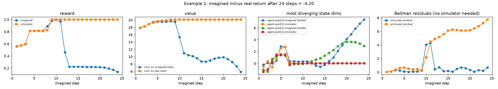
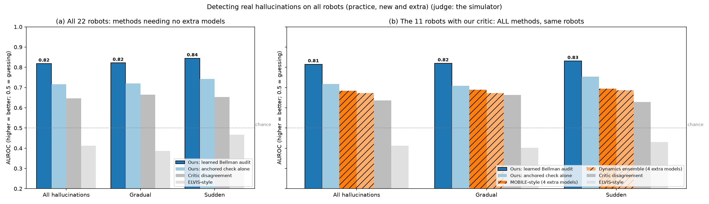
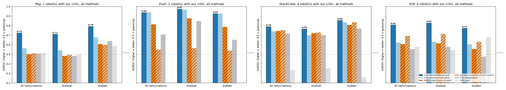
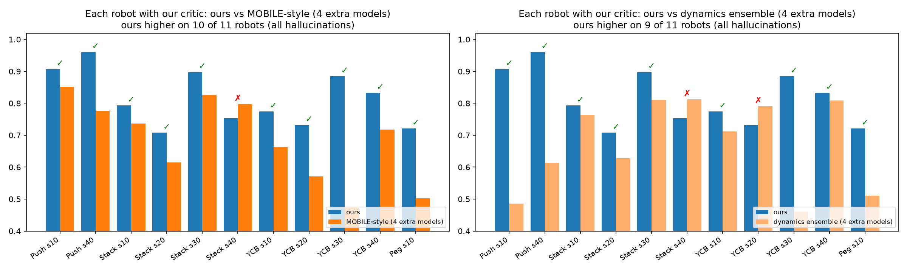

# Detecting Hallucinations in Latent World Models with the Agent's Own Critic

**Summary.** Model-based robots plan by imagining the future with a learned world model, and that imagination is sometimes wrong. We show that the robot can **detect its own hallucinations using only the critic it already has**: a critic trained on real data must satisfy the Bellman equation, and imagined steps that break it are likely hallucinations. A small learned reader of these Bellman-consistency signals is the **best detector overall** across 22 robots on 4 manipulation tasks. On the 11 robots where every method can be compared, it scores **0.815** (AUROC) vs **0.760** for a learned 4-model ensemble and **0.673** for a classic dynamics ensemble, and it beats those ensembles on **9–10 of 11 robots**, while needing **no extra models**.

---

## 1. The problem

**Setting.** We study *decoder-free latent world models* such as **TD-MPC2**. The robot turns its sensor readings into a compact list of numbers (a *latent state*) and imagines the future in that space, without generating images. A planner tries many imagined action sequences and picks the best.

**Hallucination.** Because the imagination is just numbers, we define a hallucination by its consequences:

> From a real state, give the model and the real simulator **the same action sequence**. An imagined step is **hallucinated** if what the model predicts (the rewards along the way) departs from what really happens.

Two kinds matter:

| Kind | What happens | Example |
| :-- | :-- | :-- |
| **Sudden** | the imagination breaks at one step | at step 10 the model "forgets" that the cube is already stacked |
| **Gradual** | small errors add up over several steps | each step is slightly off; after 8 steps the imagined future is clearly wrong |

**Goal.** At test time, with no simulator and no extra models, output for each imagined step the **probability that it is a hallucination**.

**Why it matters.** Planners pick the plans whose imagined future looks best, so they are drawn to exactly the plans where the model hallucinated success. Knowing when imagination stops being trustworthy is the first step towards safely planning further ahead.

---

## 2. The idea

### 2.1 A critic trained on reality ("grounded critic")

The critic **Q** estimates how much future reward to expect from a state and action. Standard TD-MPC2 trains it partly on the world model's own *imagined* states, so it can learn to accept the model's mistakes. We train the critic **only on states encoded from real observations**, which makes it an independent judge of the imagination. On correct steps, its own noise is about half that of the standard critic (e.g. StackCube 0.08 vs 0.17).

### 2.2 The Bellman residual δ: the core signal

A correct critic satisfies the **Bellman equation** at every real step:

```
Q(z_t, a_t)  =  r_t  +  γ · V(z_t+1)          (γ = 0.95,  V(z) = Q(z, π(z)))
```

In words: *what I expect from here = the reward now + (discounted) what I expect from the next state.*

Along an **imagined** rollout we measure how badly this fails:

```
δ_t  =  | Q(ẑ_t, a_t)  −  ( r̂_t  +  γ · V(ẑ_t+1) ) |          (ẑ, r̂ = imagined states and rewards)
```

- realistic imagined step → the values still "add up" → **δ small**;
- hallucinated step (a teleporting object, a "forgotten" success) → the value jumps with no reward to explain it → **δ large**.

**Worked example (StackCube).** At imagined step 10 the model forgets that the cube is stacked:

```
Q(ẑ_10, a_10) = 19.5,   r̂_10 = 1.0,   V(ẑ_11) = 15.0
δ_10 = | 19.5 − (1.0 + 0.95 × 15.0) | = 4.25          (about 0.1 on normal steps)
```

### 2.3 The anchored residual: catching gradual drift

A one-step δ catches sudden breaks, but slow drift is spread over many small steps. So we also compare the imagined future with the critic's prediction at the **real** starting state z_0, where a critic trained on real data is most reliable:

```
δ_anchored(t)  =  | Q(z_0, a_0)  −  ( r̂_0 + γ·r̂_1 + … + γ^t·r̂_t  +  γ^(t+1)·V(ẑ_t+1) ) |
```

*Does what the imagination has promised so far still match what the critic expected at the real start?* Small errors add up here and become visible.

### 2.4 The learned Bellman audit

From the critic we compute about **31 Bellman-consistency signals** per imagined step: the one-step and anchored residuals, multi-step variants (2, 3, 5, 8 steps), disagreement of the critic's 5 heads about δ, bias-corrected versions, and the running maximum of each.

No single signal is perfect, so a small **learned reader** turns them into one probability. It learns from a little of the robot's own real experience (25 episodes): imagine from real states, see which imagined steps turned out wrong, and learn which signal patterns go with real errors. We tried two readers, a weighted sum (linear) and gradient-boosted decision trees; **the tree reader did better and is our method**. The critic is not changed, and **no extra models** are needed.

> **Novelty in one sentence:** existing detectors measure *disagreement or uncertainty* (between extra world models, or between critic heads); we measure *consistency*: whether the imagined future still satisfies the Bellman equation of a critic trained only on reality, step by step and against the real starting state.

---

## 3. How we evaluated

**Tasks** (ManiSkill3, Franka Panda arm, state observations, 20 Hz):

| Task | What the robot must do |
| :-- | :-- |
| PushCube | push a cube into a goal region |
| StackCube | pick up a cube and place it on another cube |
| PickSingleYCB | pick up a real-world object (a different one each episode) and move it to a goal point |
| PegInsertionSide | pick up a peg and insert it sideways into a small hole (the hardest; trained robots rarely succeed) |

**Robots.** 22 trained TD-MPC2 agents: 4 tasks × several independent training runs ("seeds") × our critic or the standard critic.
- **Practice** robots (seed 10) were used to design the method.
- **New** robots (seed 40) were trained afterwards and only tested.
- **Extra** robots (StackCube and YCB seeds 20, 30; Peg seed 10) were trained earlier and not used to design the reader.

**Judge: the real simulator.** Our detector is built from the critic, so the critic must not decide what counts as an error. For every imagined step, the simulator replays the same actions from the same saved state, and a step is labelled a hallucination if the imagined return drifts from the real one.

**Score: AUROC.** How well a detector ranks real hallucinations above correct steps: 0.5 = guessing, 1.0 = perfect.

**Compared methods:**

| Method | Idea | Extra models |
| :-- | :-- | :-: |
| Dynamics ensemble (PETS-style) | disagreement between 5 world models | 4 |
| MOBILE-style | spread of Bellman targets across the 5 world models | 4 |
| Critic disagreement | disagreement between the critic's 5 heads | 0 |
| ELVIS-style (2026) | value + uncertainty (upper confidence bound) | 0 |
| **Ours: learned Bellman audit** | Bellman-consistency signals + learned tree reader | **0** |

The ensemble methods need 4 extra world models, which only the robots trained with our critic have. So the fair, like-for-like comparison uses those **11 robots**, with every method on the same robots.

---

## 4. What we found

### 4.1 What goes wrong in the imagination

From saved simulator states we compared 24-step imagined rollouts with the simulator, along the same actions.



*YCB: the model imagines lifting the object to 25 cm and delivering it to the goal (reward 1.0). In reality it never leaves the table (reward 0.04). Our anchored residual rises from step 2, without seeing reality.*



*Along the robot's own actions, imagination stays close to reality. Along unfamiliar action sequences (the kind a planner evaluates), it drifts 1.5–2× further and becomes increasingly **over-optimistic**, most of all for the sequences the model rates highest.*

### 4.2 The Bellman residual reacts exactly when imagination breaks



*StackCube: in reality the cube is stacked from step 10 (reward 1.0). The model's imagination "forgets" it. The one-step residual spikes exactly at step 10 (0.1 → 4.0), and the anchored residual stays high afterwards.*

---

## 5. Results

### 5.1 Overall



**The 11 robots with our critic, every method on the same robots** (AUROC; higher is better):

| Detector | Extra models | All hallucinations | Gradual | Sudden |
| :-- | :-: | :-: | :-: | :-: |
| **Ours: learned Bellman audit** | **0** | **0.815** | **0.820** | **0.831** |
| MOBILE-style | 4 | 0.685 | 0.689 | 0.694 |
| Dynamics ensemble | 4 | 0.673 | 0.672 | 0.686 |
| Critic disagreement | 0 | 0.636 | 0.663 | 0.629 |
| ELVIS-style | 0 | 0.413 | 0.402 | 0.431 |

Over all **22 robots**, with the methods available on every robot: ours **0.818 / 0.822 / 0.844** vs critic disagreement 0.646 / 0.664 / 0.653 and ELVIS-style 0.413 / 0.387 / 0.467.

### 5.2 Per task



| Task (robots with our critic) | Ours | Dynamics ensemble | MOBILE-style |
| :-- | :-: | :-: | :-: |
| Push (2 robots) | **0.934** | 0.550 | 0.814 |
| StackCube (4 robots) | **0.788** | 0.754 | 0.744 |
| YCB (4 robots) | **0.806** | 0.693 | 0.606 |
| Peg (1 robot) | **0.721** | 0.510 | 0.502 |

*"All hallucinations" score. StackCube is harder for every method; there, sudden errors: ours 0.854 vs dynamics ensemble 0.836.*

### 5.3 Robot by robot



| Robot | Ours (tree) | MOBILE-style* | Dynamics ensemble* | Critic disagreement | ELVIS-style | Ours 1st? |
| :-- | :-: | :-: | :-: | :-: | :-: | :-: |
| Push s10 (practice) | **0.907** | 0.851 | 0.486 | 0.742 | 0.174 | ✅ |
| Push s40 (new) | **0.961** | 0.777 | 0.614 | 0.673 | 0.187 | ✅ |
| StackCube s10 (practice) | **0.793** | 0.736 | 0.764 | 0.751 | 0.320 | ✅ |
| StackCube s20 (extra) | **0.708** | 0.615 | 0.628 | 0.558 | 0.442 | ✅ |
| StackCube s30 (extra) | **0.898** | 0.827 | 0.812 | 0.803 | 0.297 | ✅ |
| StackCube s40 (new) | 0.754 | 0.797 | **0.812** | 0.753 | 0.286 | ❌ |
| YCB s10 (practice) | **0.775** | 0.663 | 0.712 | 0.590 | 0.456 | ✅ |
| YCB s20 (extra) | 0.732 | 0.571 | **0.791** | 0.484 | 0.558 | ❌ |
| YCB s30 (extra) | **0.884** | 0.473 | 0.461 | 0.461 | 0.839 | ✅ |
| YCB s40 (new) | **0.833** | 0.718 | 0.809 | 0.677 | 0.468 | ✅ |
| Peg s10 (extra) | **0.721** | 0.502 | 0.510 | 0.507 | 0.514 | ✅ |
| **Ours higher on** | | **10 of 11** | **9 of 11** | **11 of 11** | **11 of 11** | **9 of 11** |

*"All hallucinations" score. Results vary between robots for every method, so the averages over many robots are what count.*

---

## 6. What this shows

1. **A robot's own critic can detect its world model's hallucinations**, both sudden and gradual, with no extra models.
2. **Consistency beats disagreement.** The critic's Bellman-consistency signals outperform the published ensemble methods (0.815 vs 0.685 and 0.673), which need 4 extra world models. Removing the Bellman signals from our reader (keeping value, reward and step) drops it to 0.746, so the Bellman checks carry the result.
3. **Anchoring to the real start matters for gradual drift.** The one-step residual reacts when an error starts; the anchored residual accumulates drift against a trustworthy reference.
4. **Training the critic only on real data** gives a cleaner, independent judge (about half the noise on correct steps).
5. **Uncertainty-only signals are not hallucination detectors.** The ELVIS-style score mostly tracks how valuable a state looks, and scores below chance here.
6. **It works on standard TD-MPC2 too.** On robots with the standard critic, ours beats critic disagreement on all 11 robots.
7. **It holds on the hardest task.** On Peg, where every other method is close to guessing (about 0.50), ours still reaches 0.72–0.76.

---

## 7. Limitations

- **Ensemble methods won on 2 of 11 robots** (StackCube s40, YCB s20), mostly on moments after the task was already solved, where the critic's value saturates.
- **Choice of reader.** We evaluated a linear and a tree-based reader identically; the tree reader was chosen after it did better on both practice and new robots. A further set of new robots with this choice fixed in advance will confirm it.
- **Labels use predicted vs real rewards**, so reward-prediction errors also count as hallucinations.
- **Four tasks from one benchmark**, with state observations (no images) so far; Peg has a single comparable robot.

## 8. Next steps

1. Confirm on more newly trained robots, with the method fixed in advance.
2. More benchmarks (e.g. DeepMind Control) and more tasks.
3. Use the detector to decide how far ahead the robot can trust its imagination.

---

## Glossary

| Term | Meaning |
| :-- | :-- |
| Latent world model | the robot's learned model that imagines the next state as a list of numbers |
| Critic (Q) | network estimating the expected future reward from a state and action (5 heads, averaged) |
| Grounded critic | a critic trained only on states encoded from real observations |
| Bellman residual δ | how much the critic's values along an imagined step fail to satisfy `Q = r + γ·V(next)` |
| Anchored residual | δ measured from the real starting state, accumulating over the imagined steps |
| Learned Bellman audit | our tree-based reader turning ~31 residual signals into a probability of hallucination |
| Ensemble | several extra world models; their disagreement indicates uncertainty |
| Seed | an independent training run; a new seed gives a new robot |
| AUROC | how well a score ranks real hallucinations above correct steps (0.5 guessing, 1.0 perfect) |
